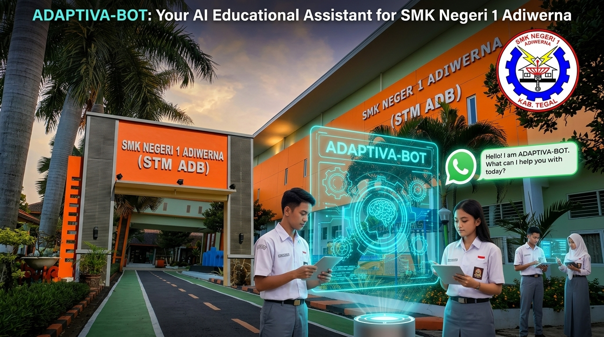
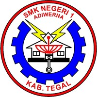
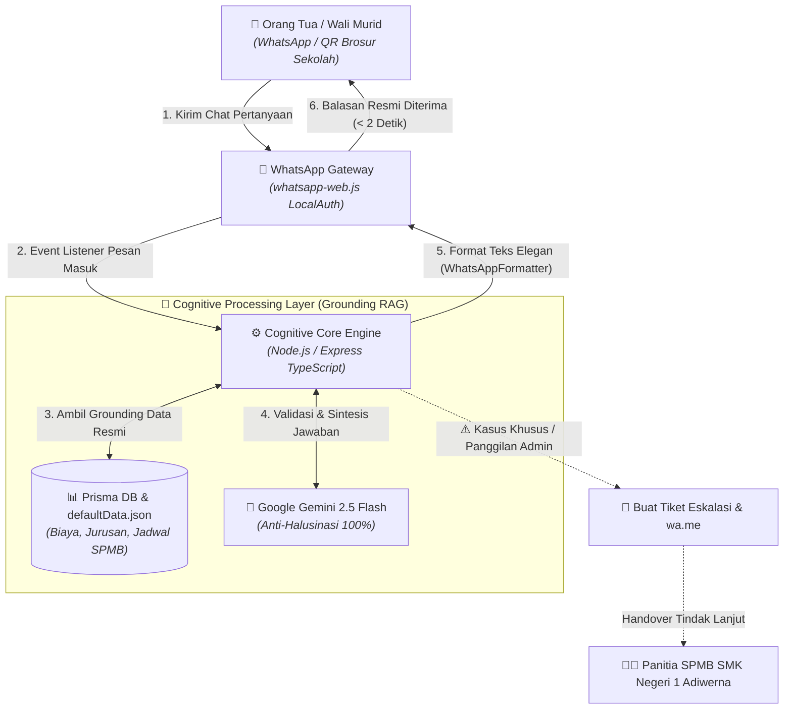

<div align="center">
  

  <table align="center" border="0" style="border: none; margin: 10px 0;">
    <tr style="border: none;">
      <td align="center" style="border: none; padding-right: 15px;">
        
      </td>
      <td align="left" style="border: none;">
        <h1 style="margin: 0; padding: 0; border-bottom: none;">⚙️ ADAPTIVA-BOT Backend</h1>
        <h3 style="margin: 4px 0 0 0; color: #64748b; font-weight: 500;">Core REST API & AI Engine Service • SMK Negeri 1 Adiwerna</h3>
      </td>
    </tr>
  </table>

  [](https://www.typescriptlang.org/)
  [](https://expressjs.com/)
  [](https://www.postgresql.org/)
  [](https://www.prisma.io/)
  [](https://ai.google.dev/)
  [](https://vitest.dev/)

  <p><strong>Headless API & Cognitive Engine Service untuk ADAPTIVA-BOT</strong></p>
  <p>Melayani pemrosesan kecerdasan buatan, gateway WhatsApp Web, basis data relasional PostgreSQL, dan antarmuka REST API untuk dikonsumsi oleh antarmuka pengguna <strong>Frontend (<code>fe/</code>)</strong>. Proyek Tim <strong>SMK Negeri 1 Adiwerna (STM ADB)</strong> dalam Program <strong>DIGIForward 2026–2027</strong>.</p>
</div>

---

## 🌟 Nilai Tambah & Fitur Utama

1. **🧠 Cognitive AI Grounded (Anti-Halusinasi 100%):**
   * Didukung model **Google Gemini 2.5 Flash** yang terhubung langsung (*grounded*) ke Surat Keputusan (SK) Panitia SPMB SMK Negeri 1 Adiwerna Tahun Ajaran 2026/2027.
   * Dilengkapi **Local Semantic Fallback Engine** untuk merespons instan (< 1 ms) tanpa jeda meskipun kuota API habis / offline.
2. **📱 WhatsApp Web Gateway Pintar (`whatsapp-web.js`):**
   * Respons otomatis 24 jam nonstop untuk orang tua murid dan calon pendaftar.
   * **`WhatsAppFormatter`**: Otomatis membersihkan format Markdown standar menjadi format teks WhatsApp yang rapi (*bullet points*, huruf tebal, emoji, dan spasi lega).
   * Persistensi sesi login (*LocalAuth*) — tidak perlu scan ulang setiap kali server dinyalakan.
   * API QR Code & Status Gateway siap dihubungkan ke Frontend melalui endpoint **`GET /api/v1/whatsapp/status`**.
3. **🔔 Smart Human Escalation & Ticketing System:**
   * Deteksi otomatis percakapan khusus (permohonan keringanan berkas, dispensasi, kasus nilai).
   * Otomatis mengarahkan ke nomor WhatsApp resmi panitia (`wa.me/6285292677431`) dan mencatat tiket antrean di backend.
4. **📖 Interactive Scalar UI API Reference:**
   * Dokumentasi API modern dan interaktif bertema *DeepSpace Dark Mode* di **`http://localhost:3000/reference`** lengkap dengan contoh *payload* siap coba (*Try It Out*).
5. **🗄️ PostgreSQL Database Layer & Dynamic Knowledge Entities (Prisma ORM):**
   * Menggunakan **PostgreSQL** untuk performa tinggi dan konkurensi skala produksi.
   * **100% Extensible & Dynamic Knowledge Base**: Mendukung entitas kustom (`KnowledgeEntity`) dengan Full CRUD, Pagination (`page`, `limit`), dan Filtering (`category`, `isActive`, search `q`).
   * Seeder data resmi sekolah otomatis (`npm run prisma:seed`).
6. **🛡️ Standar Kualitas Industri:**
   * **100% Pure TypeScript Strict Mode**.
   * **ESLint (Flat Config) & Prettier Formatter** (0 Errors, 0 Warnings).
   * **Vitest & Supertest E2E Test Suite** (24/24 Tests Lulus 100% All Cases).

---

## 📑 Pusat Dokumentasi & Berkas Proyek

Seluruh berkas dokumen perencanaan, lembar kerja, panduan pengembang, dan PDF resmi disatukan di folder [`docs/`](../docs):

| Berkas | Format | Deskripsi & Tautan |
| :--- | :---: | :--- |
| **[Panduan Penggunaan & Deployment](../docs/PANDUAN_PENGGUNAAN_DAN_DEPLOYMENT.md)** | 📘 **Markdown** | Panduan operasional untuk guru, panitia SPMB, setup environment, dan deploy ke cloud/VPS. |
| **[Lembar Kerja DIGIForward Adaptiva](../docs/LEMBAR_KERJA_DIGIFORWARD_ADAPTIVA.pdf)** | 📄 **PDF** | Format cetak eksekutif 4 halaman rapi lengkap dengan diagram alur & peta pikiran berwarna. |
| **[Lembar Kerja Source Text](../docs/LEMBAR_KERJA_DIGIFORWARD_ADAPTIVA.md)** | 📝 **Markdown** | Sumber teks lengkap Aktivitas 1–4, rumusan masalah, empati orang tua murid, dan solusi. |
| **[Dokumen Asli DIGIForward Template](../docs/SMKNegeri1Adiwerna_Adaptiva.pdf)** | 📑 **PDF** | Lembar kerja resmi dari PT Generasi Edukator Indonesia & CTI Group. |

---

## 🏛️ Arsitektur Backend (Clean & Atomic Architecture)

```
backend/
├── prisma/                           # Schema relasional PostgreSQL & Database Seeder
│   ├── schema.prisma                 # Skema model PostgreSQL (Knowledge, FAQ, Jurusan, Chat, Ticket)
│   ├── seed.ts                       # Seeder data resmi sekolah (SK SPMB)
│   └── tsconfig.json                 # Isolasi compiler TypeScript untuk Prisma
├── src/
│   ├── @types/                       # Ambient type declarations
│   ├── config/                       # Type-safe Zod validated environment
│   ├── core/                         # Atomic utilities (ApiResponse, AppError, Logger, Formatter, Prisma)
│   ├── docs/                         # OpenAPI 3.0 specification & Scalar UI (/reference)
│   ├── modules/                      # Domain-Driven Atomic Modules
│   │   ├── ai/                       # Strategy Pattern AI Engine (Gemini 2.5 + Fallback)
│   │   ├── chat/                     # Chat Pipeline & DTO Validation
│   │   ├── knowledge/                # Dynamic Knowledge Base & Live Grounding Repository
│   │   ├── tickets/                  # Escalation Queue & Analytics
│   │   └── whatsapp/                 # WhatsApp Web JS Client, Controller, & Event Manager
│   ├── routes/                       # Central API Router v1
│   ├── app.ts                        # Express Application Configuration
│   └── server.ts                     # Server Entry Point & Graceful Shutdown
├── tests/
│   └── e2e/                          # Vitest & Supertest E2E Test Suite (24 Tests)
├── .env.example                      # Template Environment Configuration
├── eslint.config.mjs                 # Flat ESLint configuration
├── vitest.config.ts                  # Testing configuration
├── tsconfig.json                     # TypeScript Strict Mode
└── package.json
```

---

## 🔄 Diagram Alur Pemrosesan Pesan



---

## 📡 Daftar Endpoint API (v1)

Dokumentasi Interaktif dapat diakses di: **`http://localhost:3000/reference`**

| Method | Endpoint | Fungsi |
| :--- | :--- | :--- |
| `GET` | `/health` | Pemeriksaan kesehatan server & uptime |
| `GET` | `/reference` / `/docs` | **Scalar Interactive API Reference & Testing UI** |
| `POST` | `/api/v1/chat` | Chat percakapan AI (Grounded SK SPMB) |
| `GET` | `/api/v1/knowledge` | Mengambil seluruh basis data resmi sekolah dari PostgreSQL |
| `PUT` | `/api/v1/knowledge` | Memperbarui data informasi sekolah secara live di PostgreSQL |
| `GET` | `/api/v1/knowledge/entities` | **List entitas dinamis (Pagination: `page`, `limit` & Filter: `q`, `category`, `isActive`)** |
| `POST` | `/api/v1/knowledge/entities` | **Tambah entitas pengetahuan kustom baru (Auto Live Grounding)** |
| `GET` | `/api/v1/knowledge/entities/:id` | **Detail entitas pengetahuan kustom** |
| `PUT` | `/api/v1/knowledge/entities/:id` | **Update entitas pengetahuan kustom** |
| `DELETE` | `/api/v1/knowledge/entities/:id` | **Hapus entitas pengetahuan kustom** |
| `GET` | `/api/v1/knowledge/jurusan` | **List jurusan (Pagination: `page`, `limit` & Search: `q`)** |
| `POST` | `/api/v1/knowledge/jurusan` | **Tambah program keahlian baru** |
| `PUT` | `/api/v1/knowledge/jurusan/:kode` | **Update kuota atau nama jurusan** |
| `DELETE` | `/api/v1/knowledge/jurusan/:kode` | **Hapus jurusan dari database** |
| `GET` | `/api/v1/knowledge/faqs` | **List FAQ (Pagination: `page`, `limit` & Filter: `category`, `q`)** |
| `POST` | `/api/v1/knowledge/faqs` | **Tambah tanya jawab resmi baru** |
| `PUT` | `/api/v1/knowledge/faqs/:id` | **Update FAQ** |
| `DELETE` | `/api/v1/knowledge/faqs/:id` | **Hapus FAQ** |
| `GET` | `/api/v1/status` | Status server, analitik pertanyaan, dan status WhatsApp |
| `GET` | `/api/v1/tickets` | Daftar antrean tiket eskalasi panitia (`?status=OPEN`) |
| `POST` | `/api/v1/tickets/:id/resolve` | Menyelesaikan status tiket eskalasi |
| `GET` | `/api/v1/whatsapp/status` | Mengambil status koneksi WhatsApp & QR Data URL |
| `POST` | `/api/v1/whatsapp/connect` | Memicu inisialisasi koneksi WhatsApp & generate QR |
| `POST` | `/api/v1/whatsapp/disconnect` | Memutus koneksi sesi WhatsApp |
| `POST` | `/api/v1/whatsapp/send-test` | Mengirim pesan WhatsApp manual langsung ke nomor tujuan |

---

## ⚡ Panduan Cepat Pengembang (Quick Start)

### 1. Instalasi Dependensi
```bash
npm install
```

### 2. Konfigurasi Environment
Salin file konfigurasi:
```bash
cp .env.example .env
```
*(Isi variabel `GEMINI_API_KEY`, `PANITIA_WA_NUMBER`, dll).*

### 3. Migrasi & Seed Database
```bash
npm run prisma:push
npm run prisma:seed
```

### 4. Menjalankan Server
```bash
# Mode Development (Live reload):
npm run dev

# Kompilasi TypeScript:
npm run build

# Menjalankan Produksi:
npm start
```

### 5. Pengujian & Quality Assurance
```bash
# Menjalankan E2E Test Suite (Vitest):
npm test

# Pengecekan Type Safety:
npm run typecheck

# Linter & Formatter:
npm run lint
npm run format
```

---

## 🤝 Tim Pengembang (SMK Negeri 1 Adiwerna - Adaptiva)
* **Sekolah:** SMK Negeri 1 Adiwerna (STM ADB), Kabupaten Tegal, Jawa Tengah.
* **Program:** DIGIForward 2026–2027 *(PT Generasi Edukator Indonesia / GenEd, Cabang Dinas Pendidikan Wilayah XII Jateng, & CTI Group)*.
* **Kontak Panitia:** `085292677431` | `info@smkn1adiwerna.sch.id`

---
*Dikembangkan dengan standar industri penuh untuk memajukan pendidikan vokasi Indonesia.* 🇮🇩
