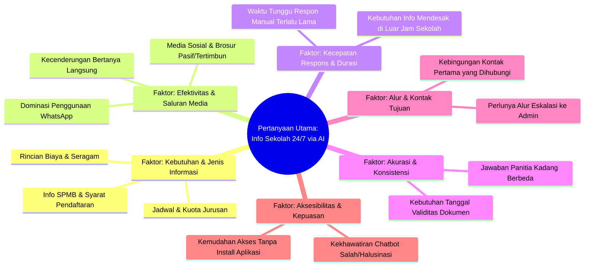
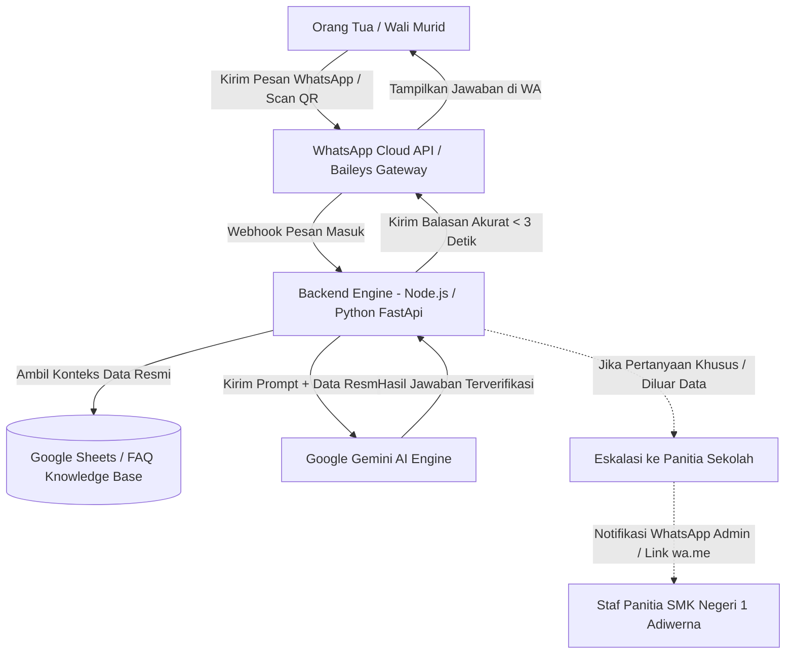

# Lembar Kerja Peserta Didik: DIGIForward 2026–2027
## Solusi Digital Berbasis Cognitive Automation (AI) dan Agile Architecture

**Nama Tim:** SMK Negeri 1 Adiwerna - Adaptiva  
**Sektor Layanan:** Layanan Pendidikan  
**Target Pengguna:** Orang Tua / Wali Murid & Panitia Sekolah  
**Nama Solusi:** ADAPTIVA-BOT (Agile Digital Assistant for Public & Timely Information via Automated AI)

---

## 📋 DAFTAR ISI
1. [Aktivitas 1: Kontekstualisasi](#aktivitas-1-kontekstualisasi)
2. [Aktivitas 2: Berempati (Empathize)](#aktivitas-2-berempati-empathize)
3. [Aktivitas 3: Merumuskan Masalah (Problem Framing)](#aktivitas-3-merumuskan-masalah-problem-framing)
4. [Aktivitas 4: Mencari Ide Solusi (Ideate & Final Concept)](#aktivitas-4-mencari-ide-solusi-ideate--final-concept)

---

## Aktivitas 1: Kontekstualisasi

### A. Masalah yang Dipilih
> **Pilihan: h (Layanan Pendidikan)**  
> *Menjelang tahun ajaran baru, panitia sekolah sering kewalahan dalam menangani pertanyaan dari orang tua murid yang berulang, seperti mengenai pembayaran SPP, jadwal masuk, rincian seragam, dan lainnya. Hal tersebut banyak menyita waktu panitia sekolah sehingga mengganggu mereka dalam mengerjakan pekerjaan utama.*

### B. Pertanyaan Utama & Pengguna Utama
* **Pertanyaan Utama:**  
  *"Bagaimana Cognitive AI dapat membantu orang tua murid memperoleh informasi sekolah yang cepat, akurat, dan terpusat (24/7) untuk menjawab kebutuhan informasi mereka menjelang tahun ajaran baru?"*
* **Pengguna Utama:**  
  **Orang Tua / Wali Murid** (serta Panitia Sekolah sebagai penerima manfaat operasional).

---

### C. Menyelidiki Kebutuhan Utama Pengguna (Mind Map 6 Faktor)

#### Rincian 6 Faktor:
1. **Faktor: Kebutuhan & Jenis Informasi**
   * Informasi apa yang paling sering dicari dan sulit didapat orang tua (biaya, seragam, jadwal)?
   * Informasi apa yang seharusnya sudah tersedia jelas sejak awal?
2. **Faktor: Efektivitas & Saluran Media Informasi**
   * Di platform mana orang tua paling sering mencari info resmi?
   * Mengapa orang tua tetap memilih bertanya langsung meski brosur sudah dibagikan?
3. **Faktor: Kecepatan Respons & Durasi Tunggu**
   * Berapa lama orang tua harus menunggu balasan pesan dari pihak sekolah?
   * Kapan jam puncak (*peak time*) kebutuhan informasi yang mendesak?
4. **Faktor: Akurasi & Konsistensi Informasi**
   * Apakah orang tua pernah mendapat jawaban berbeda-beda dari panitia?
   * Bagaimana memastikan informasi yang diterima benar-benar valid dan mutakhir?
5. **Faktor: Alur & Kontak Tujuan Orang Tua**
   * Siapa kontak pertama yang dicari orang tua ketika mengalami kebingungan?
   * Bagaimana proses orang tua mencari kepastian lanjutan?
6. **Faktor: Aksesibilitas & Kepuasan Pengguna**
   * Apakah orang tua puas dengan layanan saat ini?
   * Apakah orang tua terbiasa menggunakan platform pesan otomatis/AI?

---

### D. Hipotesis Awal
* **Faktor Utama Terpilih:** *Faktor: Efektivitas & Saluran Media Informasi*
* **Elemen Kebutuhan:** Layanan informasi interaktif berbasis percakapan (*conversational AI*) yang cepat, akurat, dan terpusat selama 24/7.
* **Penjelasan:** Media informasi sekolah yang ada saat ini (seperti brosur, website, atau media sosial) bersifat pasif/satu arah dan mudah tertimbun. Orang tua kesulitan menemukan jawaban cepat untuk pertanyaan spesifik, sehingga terpaksa menunggu balasan manual dari panitia yang sering kali lambat dan menyita jam kerja panitia.

---

## Aktivitas 2: Berempati (Empathize)

### A. Persiapan Instrumen & Daftar Pertanyaan Wawancara/Survei
1. Saat membutuhkan informasi tentang sekolah anak, biasanya Bapak/Ibu mencari info melalui media atau pihak mana?
2. Dalam 3 tahun terakhir, informasi sekolah apa yang paling sering Bapak/Ibu cari?
3. Seberapa sering Bapak/Ibu harus menghubungi pihak sekolah untuk mendapatkan informasi yang dibutuhkan?
4. Pernahkah menemukan informasi sekolah yang kurang lengkap/jelas sehingga harus mencari penjelasan tambahan? Ceritakan pengalamannya.
5. Ketika mendapatkan informasi yang berbeda, bagaimana cara Bapak/Ibu menentukan informasi yang benar?
6. Ketika belum mendapat jawaban dari sekolah, berapa lama biasanya harus menunggu balasan?
7. Pernahkah menggunakan grup WhatsApp sekolah untuk mencari informasi? Bagaimana pengalamannya?
8. Bayangkan sedang butuh info penting di malam hari atau hari libur. Apa yang Bapak/Ibu lakukan?
9. Jika sekolah menyediakan layanan otomatis penjawab cepat, hal apa yang paling penting agar layanan tersebut benar-benar membantu?
10. Apakah ada hal yang membuat tidak nyaman dengan layanan otomatis/chatbot (misal: takut info salah, sulit digunakan)?

* **Daftar Pengamatan Non-Verbal:** Analisis pola pengisian form mandiri (waktu submit, pertanyaan yang paling lama dijawab, dan bagian yang membutuhkan pendampingan).

---

### B. Temuan Kunci dari Wawancara & Pengamatan
* **Platform Dominan:** Orang tua paling aktif dan nyaman berkomunikasi melalui **WhatsApp**. Akses website atau medsos dianggap kurang praktis untuk pertanyaan mendesak.
* **Topik Krusial:** Biaya seragam, jadwal SPMB, rincian daftar ulang, syarat administrasi, dan keunggulan jurusan.
* **Masalah Jam Akses:** Kebutuhan informasi tinggi di malam hari dan akhir pekan (di luar jam kerja sekolah).
* **Kekhawatiran Terhadap AI:** Orang tua khawatir jika bot memberikan informasi salah (*halusinasi*), bahasa terlalu kaku/teknis, atau tidak bisa menghubungkan ke pihak sekolah saat menghadapi kendala khusus.

---

### C. Revisi & Penajaman Hipotesis
> **Hipotesis yang Disempurnakan:**  
> *"Orang tua murid membutuhkan asisten percakapan cerdas yang terintegrasi langsung di aplikasi familiar (WhatsApp), berbasis sumber data resmi sekolah (anti-halusinasi), aktif 24/7, berbahasa ramah/sederhana, serta memiliki mekanisme eskalasi otomatis ke admin/panitia manusia jika menemukan pertanyaan yang membutuhkan konfirmasi khusus."*

---

## Aktivitas 3: Merumuskan Masalah (Problem Framing)

| Komponen | Penjelasan Detail |
| :--- | :--- |
| **1. Kondisi Saat Ini** | Orang tua murid berulang kali menanyakan hal yang sama mengenai SPMB, biaya, dan berkas melalui chat manual atau datang langsung. Media publikasi sekolah pasif dan mudah tertimbun, sedangkan panitia kewalahan membalas chat satu per satu sehingga waktu layanan menjadi lambat. |
| **2. Kondisi yang Diinginkan** | Orang tua memperoleh jawaban akurat, resmi, dan instan selama 24/7 melalui aplikasi percakapan yang sudah familiar. Beban repetitif panitia tereduksi signifikan sehingga panitia dapat fokus pada tugas strategis. |
| **3. Kesenjangan (Gap)** | Belum dimanfaatkannya agen percakapan berbasis **Cognitive AI** yang terhubung langsung ke basis data sekolah untuk menyaring serta menjawab pertanyaan umum secara otomatis. |

### 4 Batasan Kunci Perancangan Solusi:
1. **Aksesibilitas & Platform Familiar:** Solusi wajib dapat diakses langsung via WhatsApp / antarmuka web tanpa mengharuskan pengguna mengunduh aplikasi tambahan yang rumit.
2. **Akurasi Data (Zero Hallucination):** Jawaban AI harus terkunci (*grounded*) pada dokumen regulasi dan data resmi sekolah, dilengkapi keterangan masa berlaku info.
3. **Eskalasi ke Staf Manusia (Fallback Mechanism):** Tersedia tombol/jalur pintas untuk mengalihkan chat ke kontak panitia apabila pertanyaan di luar domain data AI.
4. **Kemudahan Bahasa & Antarmuka:** Penggunaan bahasa Indonesia sehari-hari yang santun, ringkas, dan mudah dipahami oleh orang tua dengan berbagai latar belakang literasi digital.

---

## Aktivitas 4: Mencari Ide Solusi (Ideate & Final Concept)

### A. Kumpulan Ide Solusi (Halaman 14)
1. Chatbot di website sekolah *(Dieliminasi karena trafik ortu mayoritas di WhatsApp)*
2. **Chatbot terintegrasi melalui WhatsApp**
3. **QR Code pada brosur & banner yang langsung mengarahkan ke nomor WhatsApp bot**
4. **Menu tombol pertanyaan populer (FAQ interaktif)**
5. **Fitur eskalasi otomatis (*Smart Fallback to Admin*) jika pertanyaan membutuhkan penanganan personal**
6. **Pemrosesan bahasa alami menggunakan bahasa sehari-hari yang ramah dan inklusif**
7. **Pencantuman tanggal berlaku & sumber SK resmi pada setiap balasan informasi**

---

### B. Seleksi Ide & 5 Filter Batasan DIGIForward (Halaman 15)

* **Nomor Ide yang Terpilih & Dikombinasikan:** **2, 3, 4, 5, 6, 7**  
  *(Ide 1 dieliminasi agar solusi berfokus maksimal pada platform yang paling banyak dipakai orang tua, yaitu WhatsApp).*

#### Validasi 5 Filter Batasan DIGIForward:
* [x] **Kesesuaian Masalah (Cognitive Automation/AI):**  
  Masalah tanya jawab SPMB bersifat manual, repetitif, bervolume tinggi, dan butuh pemrosesan informasi cepat tanpa jeda.
* [x] **Kemudahan Integrasi (Agile Architecture):**  
  Menggunakan arsitektur berbasis API (WhatsApp Business Cloud API + NLP Webhook + Cloud Knowledge Base). Data dapat diupdate lewat spreadsheet/database sederhana tanpa merombak sistem IT sekolah yang sudah ada.
* [x] **Kemudahan Bagi Pengguna:**  
  Sangat mudah digunakan: orang tua cukup chat di WhatsApp seperti mengirim pesan biasa ke keluarga, atau scan QR code dari brosur/spanduk sekolah.
* [x] **Dapat Diuji Secara Langsung (Hackathon-Ready):**  
  Dapat dibangun dan didemonstrasikan secara *end-to-end* dalam waktu 2 hari Hackathon (simulasi WhatsApp Bot + Webhook NLP Engine + Dashboard Panitia).

---

### C. Fungsi Cognitive Automation yang Dibutuhkan (Halaman 16)

* [x] **Natural Language Processing (NLP):**  
  *Question answering*, ekstraksi maksud pertanyaan (*intent & entity recognition*), dan penanganan variasi kata/bahasa santai orang tua.
* [x] **App Integration:**  
  Menghubungkan saluran WhatsApp, basis data dokumen sekolah, serta notifikasi eskalasi pesan ke nomor panitia.
* [x] **UI Automation / Machine Learning (Decision Support):**  
  Klasifikasi otomatis tiket pertanyaan masuk dan analisis topik yang paling sering ditanyakan untuk laporan evaluasi berkala sekolah.

---

### D. Konsep Awal: Ide Solusi — Siap Seleksi Hackathon (Halaman 17)

#### 1. Nama Solusi & Ringkasan:
> **ADAPTIVA-BOT (Agile Digital Assistant for Public & Timely Information via Automated AI)**  
> *Asisten percakapan cerdas berbasis WhatsApp yang memberikan informasi resmi sekolah (SPMB, rincian biaya, jadwal, berkas) secara instan 24/7 dengan jaminan data anti-halusinasi serta fitur pengalihan otomatis ke panitia sekolah saat diperlukan.*

#### 2. Pengguna Utama & Masalah:
> **Pengguna:** Orang tua/wali murid calon siswa dan Panitia Sekolah SMK Negeri 1 Adiwerna.  
> **Dampak Masalah:** Orang tua kesulitan memperoleh kepastian informasi cepat di luar jam kerja sekolah, sementara panitia kehabisan waktu produktif karena harus melayani ratusan pesan berulang setiap hari.

#### 3. Kesenjangan (Gap) yang Perlu Diatasi:
> Belum tersedianya saluran komunikasi interaktif 24/7 yang *grounded* pada basis data resmi sekolah dan mampu memfilter serta memproses pertanyaan repetitif secara mandiri.

#### 4. Cara Kerja Solusi (Cognitive Automation & Agile Architecture):
> * **Cognitive Automation (AI):**  
>   Pengguna mengirim pesan via WhatsApp atau memindai QR code brosur. Mesin NLP memproses kalimat santai pengguna, mencocokkannya ke basis pengetahuan resmi (*RAG/Knowledge Base*), dan merespons dalam hitungan detik beserta tanggal validitas info.
> * **Agile Architecture:**  
>   Sistem dibangun secara modular menggunakan microservice API. Pembaruan informasi biaya atau jadwal cukup dilakukan oleh staf melalui spreadsheet/portal admin tanpa mengubah arsitektur kode. Apabila AI mendeteksi pertanyaan khusus di luar domain data, sistem secara otomatis meneruskan riwayat chat ke admin panitia (*Human Fallback*).

#### 5. Dampak yang Diharapkan:
> * **Bagi Orang Tua:** Mendapatkan jawaban resmi, akurat, dan seragam dalam < 5 detik kapan saja (24/7) tanpa perlu mengunduh aplikasi baru.
> * **Bagi Panitia Sekolah:** Mengurangi beban penanganan pesan berulang hingga **75–85%**, sehingga panitia dapat berfokus penuh pada validasi berkas fisik, seleksi siswa, dan pelayanan tatap muka.

---

## 🛠️ Lampiran: Rancangan Teknis & Realisasi 100% Gratis (Skala SMK)

### Tabel Komponen Biaya Nol (Zero-Cost Stack):
| Layer Arsitektur | Teknologi yang Digunakan | Biaya | Keunggulan |
| :--- | :--- | :---: | :--- |
| **Channel Pengguna** | WhatsApp Business Cloud API *(Free Tier 1000 chat/bln)* atau WhatsApp-Web.js | **Rp 0** | Tidak perlu install aplikasi tambahan di HP orang tua. |
| **AI / NLP Processing** | Google Gemini API (Free Quota via Google AI Studio) | **Rp 0** | Pemrosesan bahasa alami cepat, cerdas, dan gratis. |
| **Penyimpanan Data** | Google Sheets API / Supabase Free Tier | **Rp 0** | Panitia sekolah tinggal update spreadsheet tanpa coding. |
| **Server & Hosting** | Vercel / Render.com / Cloudflare Workers Free Tier | **Rp 0** | Otomatis online 24/7 di cloud tanpa perlu sewa server. |
| **Fallback Human** | Deep-link WA Web (`wa.me/nomor-admin?text=...`) | **Rp 0** | Otomatis mengarahkan kasus rumit ke kontak panitia. |

---
*Dokumen ini disusun untuk Tim SMK Negeri 1 Adiwerna - Adaptiva dalam program DIGIForward 2026.*
